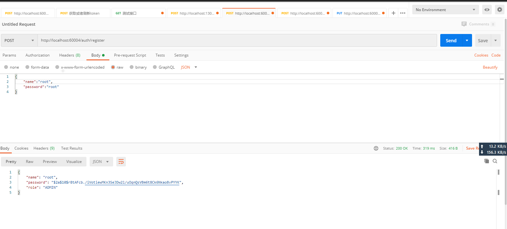
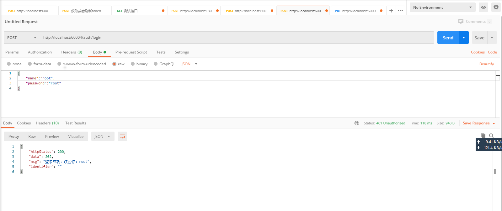
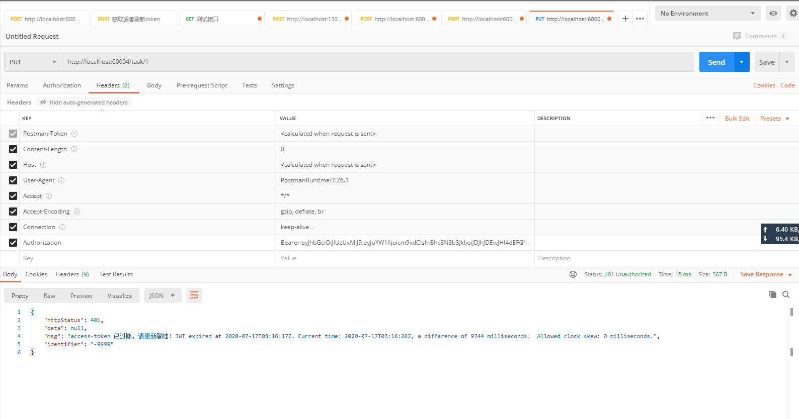

## 1:注册：
POST: http://localhost:60004/auth/register
```shell script
{
    "name":"root",
    "password":"root"
}
```


## 2:登录：支持form表单和json数据格式
### json数据格式

### form表单数据格式


## 3：拿着上一步登录成功的数据去请求受保护的资源

### 登录成功-返回jwt


### 携带jwt请求受保护的资源


### Jwt-已过期.png


### Jwt解析成功的用户无权限时,抛出异常：

