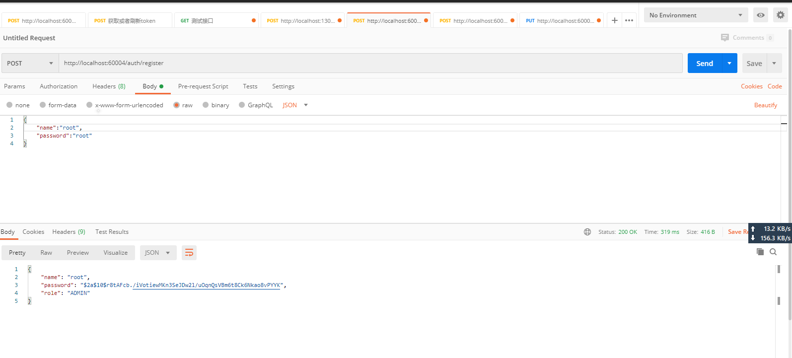
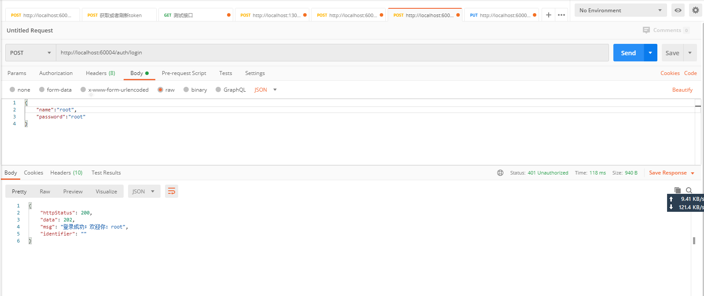
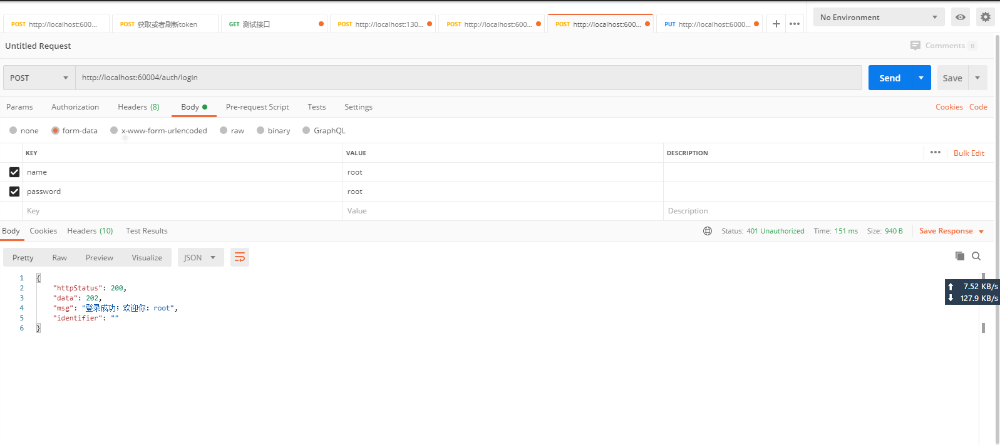
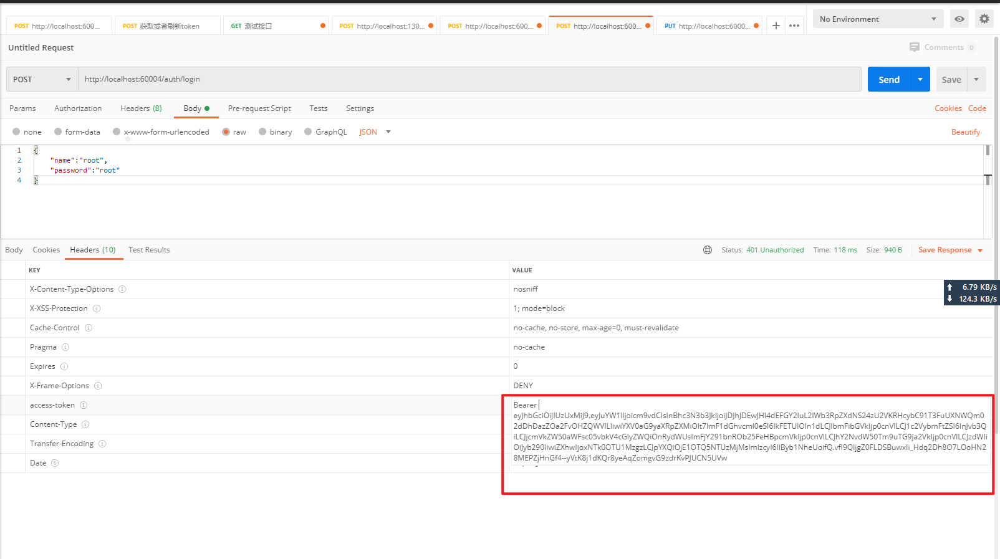
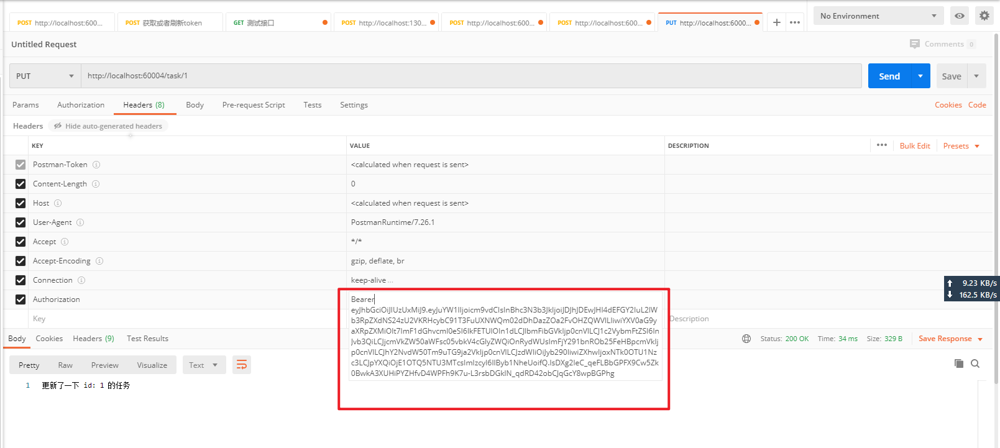
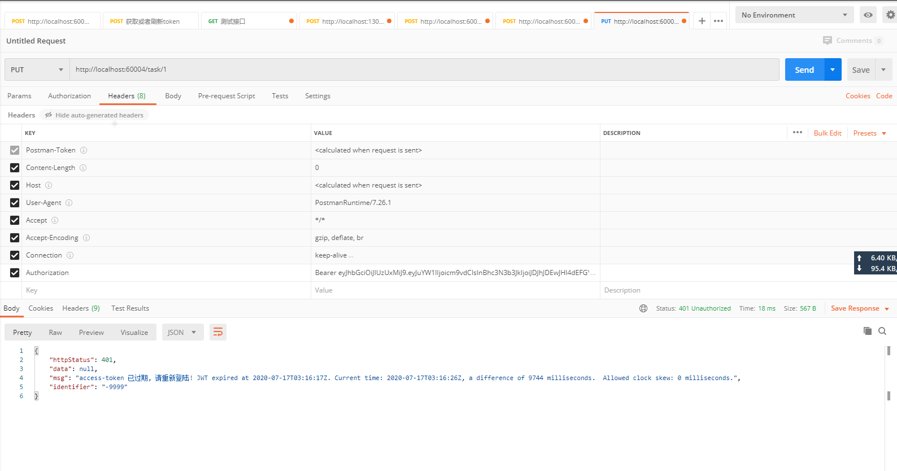
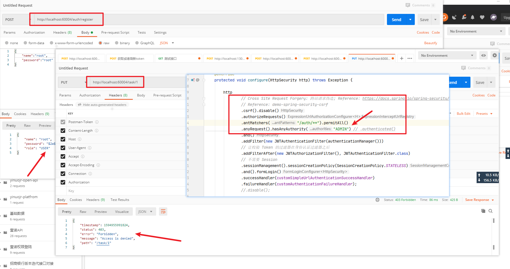

## 1:注册：
POST: http://localhost:60004/auth/register
```shell script
{
    "name":"root",
    "password":"root"
}
```


## 2:登录：支持form表单和json数据格式
### json数据格式

### form表单数据格式



## 3：拿着上一步登录成功的数据去请求受保护的资源

### 登录成功-返回jwt


### 携带jwt请求受保护的资源


### Jwt-已过期.png


### Jwt解析成功的用户无权限时,抛出异常：



### 不足地地
不足:
> csrf 在本例中未作处理, 而是直接禁用的, 不够安全。
> access-token 没有缓存未作过期，仅仅是依赖jwt解析的异常。
> 新建的用户权限是写死的, 每次更改权限需要重启服务
> 整个模块返回信息结构仍然是框架提供的默认结构, 很多场合下我们更希望用自己统一的结构返回给前端, 无论是异常还是正常;
